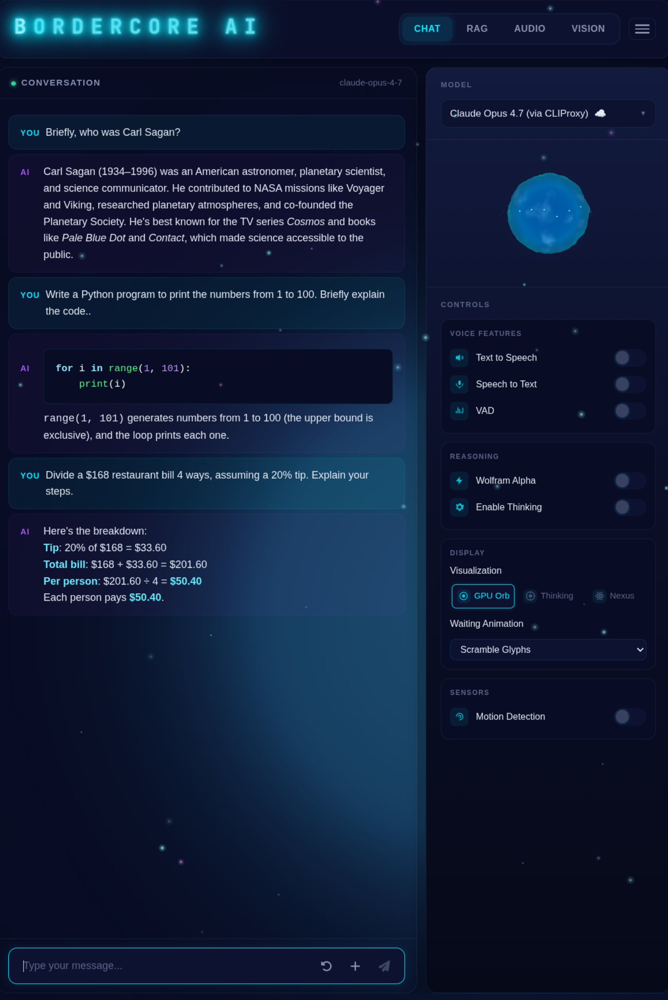

---

Bordercore AI is a web-based AI chatbot and voice assistant supporting multiple open-weight and commercial LLMs, Text to Speech (TTS), Speech to Text (STT), audio transcription and RAG (Retrieval Augmented Generation). Discord bots are also supported.



# Features

## Inference engines and providers

| Engine or provider | Use | Models and formats |
|--------------------|-----|--------------------|
| [vLLM](https://docs.vllm.ai/) | Primary local GPU inference server | Managed Hugging Face/Safetensors checkpoints, including quantized text and multimodal models |
| [llama.cpp](https://github.com/ggml-org/llama.cpp) | Managed GPU server or in-process fallback through `llama-cpp-python` | GGUF models, including Qwen3.6 vision |
| [Transformers](https://huggingface.co/docs/transformers/) | In-process non-AWQ model loading and speech recognition | Hugging Face text, vision, and Whisper-compatible checkpoints |
| OpenAI-compatible APIs | Hosted or local API inference | OpenAI and compatible endpoints, including vLLM and API proxies |
| Anthropic API | Hosted Claude inference | Anthropic models |

AWQ checkpoints are served exclusively through vLLM; the application no longer
loads them in-process with AutoAWQ. Managed profiles safely switch between the
vLLM and llama.cpp loopback APIs, with health checks and rollback. See
[`deploy/linux/systemd/README.md`](deploy/linux/systemd/README.md) for the
current profile inventory and deepvirtual service setup.

When a local model is active, the model picker includes an **Unload local
model** action. It stops managed inference services and releases in-process
weights so the GPU can be used by other workloads. The selected model remains
visible and can be selected again to reload it. Speech recognition has a
separate lifecycle: its resident Whisper pipeline follows the configured idle
timeout or can be released explicitly through the ASR API.

## Text to Speech (TTS)

Three TTS engines are supported: [Kokoro](https://kokorottsai.com/), [Chatterbox](https://github.com/resemble-ai/chatterbox), and [Qwen3-TTS](https://huggingface.co/Qwen/Qwen3-TTS-12Hz-0.6B-Base).

Assistant responses are normalized on a copy before being sent to any TTS
engine; the Markdown displayed in chat is never changed. The ordered spoken-text
pipeline:

- omits fenced code, images, citations, configured do-not-speak content, and
  emoji;
- speaks link labels while replacing bare URLs with “link”;
- removes Markdown formatting and HTML tags while retaining readable text;
- applies configured pronunciation overrides; and
- collapses whitespace and skips sentences that become empty.

Exact normalized sentences are available in the browser's debug console as
`[TTS] normalized segment` entries. Configure pronunciation and omission rules
in `settings.py`:

```python
tts_pronunciations = {
    "BordercoreAI": "Bordercore A I",
    "GPU": "G P U",
}

# Trusted JavaScript regular expressions applied to spoken text only.
tts_do_not_speak_patterns = [
    r"\[internal\][\s\S]*?\[/internal\]",
]
```

Responses can also mark explicit omissions with
`<nospeak>...</nospeak>`, `<tts-ignore>...</tts-ignore>`, or paired
`<!-- tts-ignore-start -->` and `<!-- tts-ignore-end -->` comments.

### TTS capability discovery

Each maintained TTS service exposes `GET /capabilities` with a versioned
contract describing its engine, readiness, streaming audio format, sample
rate, voices, default voice, speed support, and voice-cloning support:

```json
{
  "api_version": 1,
  "engine": "kokoro",
  "status": "ready",
  "streaming": true,
  "audio_format": "wav_pcm_s16le",
  "sample_rate": 24000,
  "voices": ["af_heart", "bf_emma"],
  "default_voice": "bf_emma",
  "supports_speed": true,
  "supports_cloning": false
}
```

The browser queries this endpoint whenever the selected TTS host changes,
caches successful responses for 30 seconds, and provides a manual refresh
control in Preferences. The Voice menu is populated from the selected server,
so profiles from one engine are not sent to another. Readiness is shown as
loading, ready, degraded, or failed.

Older and custom TTS servers remain compatible. A missing or incompatible
capability endpoint produces a degraded state and falls back to the voice list
provided by the main web application. Network and server failures are shown
without discarding that fallback list.

## Speech to Text (STT)

Speech recognition uses Hugging Face Transformers with
[Distil-Whisper](https://huggingface.co/distil-whisper/distil-large-v3), based
on OpenAI's [Whisper](https://github.com/openai/whisper). The model loads on
the first recording and stays resident so subsequent transcriptions start
quickly. By default, it unloads after 15 minutes without a transcription to
release its GPU memory. The timeout can be changed in Preferences, including
an option to keep the model loaded with no timeout.

For manual recording, turn **Speech to Text** on, speak, and turn it off to
stop recording and submit the audio for transcription. When VAD is enabled,
voice activity detection can stop the recording automatically.

## RAG (Retrieval Augmented Generation)

Chat with your uploaded documents.

## Audio Transcription

Upload audio files to convert them to text, then ask questions based on the generated transcription. YouTube URLs are also supported.

## Multimodality

Support for the **Qwen3-VL** and unified Qwen vision models for analyzing
images. Upload images or drag-and-drop them into the UI.

## Tool Calling

Built-in tools include Wolfram Alpha (math), weather lookup, Govee smart-light control, music playback, and Google Calendar. Additional tools can be exposed via [Model Context Protocol (MCP)](https://modelcontextprotocol.io/) servers — see `MCP_SERVERS` in `settings_template.py`.

## Thinking

Supports some so-called "thinking" models, such as Qwen3.

## Chat with Web Pages

Paste a URL into the input box and say "Summarize" or something similar.

## Discord Bot Support

Discord bots can be backed by either OpenAI's ChatGPT or an open source LLM.

Set your server's channel ID in `settings.discord_channel_id`.

Set the environment variable `DISCORD_TOKEN`.

To run the local LLM bot:

```bash
python3 -m modules.chatbot -m localllm
```

To run the ChatGPT bot:

```bash
python3 -m modules.chatbot -m chatgpt
```

## Sensor Support

Experimental support for reading real-time sensor data. This can be used, for example, to activate Speech to Text by waving a hand in front of a sensor like the HLK-LD2410B.

To run the sensor webapp:

```bash
python3 -m sensor
```

# Installation

Bordercore AI requires:

- Python 3.12 (the project currently supports `>=3.12,<3.13`)
- Node.js and npm for the React frontend (CI uses Node.js 22)
- The `ffmpeg` executable for decoding uploaded and recorded audio
- PortAudio development libraries for microphone/audio support
- An NVIDIA GPU with a compatible CUDA environment for local GPU inference;
  hosted APIs and some Transformers workloads can run without one, and speech
  recognition can be configured to use the CPU

For example, install the native audio dependencies on Ubuntu:

```bash
sudo apt install ffmpeg portaudio19-dev
```

Python dependencies are managed with
[uv](https://github.com/astral-sh/uv). From the project root:

```bash
uv sync
```

Alternatively, create and activate a Python 3.12 virtual environment, then
install the dependencies from the project metadata:

```bash
pip install .
```

The application modules are run from the repository rather than installed as
a conventional Python package. Install and build the frontend package:

```bash
cd webapp
npm ci
npm run vite:build
cd ..
```

Copy `settings_template.py` to `settings.py` and set the following:

- **model_name**: default model to load.
- **model_dir**: absolute or relative path containing local model checkpoints.
- **asr_model**: Hugging Face speech-recognition model identifier.
- **asr_device**: speech-recognition device (`auto`, `cpu`, `cuda`, or a
  specific device such as `cuda:0`).
- **asr_idle_timeout_minutes**: number of idle minutes before the resident
  speech-recognition pipeline unloads; use `None` for no timeout.

Edit `models.yaml` to add configuration options for your models. Use `models_template.yaml` as a guide. Example:

```yaml
Qwen3-8B-AWQ-vLLM:
  name: Qwen3 8B AWQ
  type: api
  vendor: openai
  base_url: http://127.0.0.1:8001/v1
  api_key: not-needed
  thinking: true
  vllm_profile: Qwen3-8B-AWQ

example-model.gguf:
  name: Example GGUF model
  template: chatml
```

- **name** is the human-friendly label used in the UI.
- **template** selects the fallback local-model chat template, such as `chatml`
  or `llama2`; a tokenizer's built-in template takes precedence.
- **type: api** identifies an API-backed model instead of an in-process local
  checkpoint.
- **vendor** selects the API client: `openai` for OpenAI-compatible endpoints or
  `anthropic` for Anthropic.
- **base_url** and **api_key** override the configured OpenAI-compatible endpoint
  and credentials for that model.
- **vllm_profile** connects a model entry to an allow-listed managed vLLM
  profile.
- **llama_cpp_profile** connects a GGUF API entry to an allow-listed managed
  llama.cpp profile.
- **quantize: true** requests 4-bit bitsandbytes quantization for a compatible
  non-AWQ Transformers model; bitsandbytes must be installed separately.
- **qwen_vision: true** enables Qwen vision request handling.
- **thinking_control: chat_template_kwargs** sends the UI thinking toggle as a
  structured chat-template option. Qwen3.5 requires this instead of the legacy
  `/no_think` text command.
- **do_sample: false** disables sampling via `temperature`, `top_p`, and `top_k`.
- **add_bos_token: true** prepends a beginning-of-sequence token.

To run:

```bash
python3 -m webapp
```

To access: https://localhost:5010/

## Speech-recognition operations

The web application exposes lifecycle endpoints for the resident
speech-recognition pipeline:

| Method | Endpoint | Purpose |
|--------|----------|---------|
| `GET` | `/asr/status` | Report model state, device, timings, request count, and idle timeout |
| `POST` | `/asr/load` | Load the configured model before the next recording |
| `POST` | `/asr/unload` | Unload the model and release its GPU memory |
| `POST` | `/asr/config` | Change the idle timeout at runtime |

To change the timeout through the API, send a positive number of minutes or
`null` for no timeout:

```bash
curl --insecure -X POST https://localhost:5010/asr/config \
  -H 'Content-Type: application/json' \
  -d '{"idle_timeout_minutes": 15}'
```

`--insecure` is only needed when running with the application's local
self-signed development certificate.

## PostgreSQL MCP server (pg-mcp-server)

1. Configure `pg_mcp_server.toml` with your local Postgres connection string. Leave `allow_writes = false` to keep sessions read-only.
2. Make sure project dependencies are installed (see [Installation](#installation)).
3. Start the MCP server (defaults to HTTP transport on `127.0.0.1:8000/mcp`):
   ```bash
   python run_pg_mcp_server.py
   ```
4. Point the app to the MCP server by adding to `settings.py`:
   ```python
   MCP_SERVERS = {
       "postgres": {
           "url": "http://127.0.0.1:8000/mcp",
           "transport": "http",
       },
       # ...other servers...
   }
   ```

## Command line

You can interact with the API via the command-line:

```bash
python3 -m modules.chatbot -m interactive
```

Options:

- `--tts`: enable the configured TTS service.
- `--stt`: enable speech-to-text input.

To use RAG with a local file:

```bash
python3 -m modules.rag -f <filename>
```

# Usage

## UI

Type your text into the input box to send a message to the chatbot.

To the immediate right of the input box are two buttons. The first is **Regenerate Response**, which will re-send the last message to the chatbot, presumably in hopes that a different response will result. The second is **New Chat**, which will clear the chat history.

The **Selected Model** dropdown lets you choose which LLM the API uses to respond to your prompt.

### Options panel

Toggle features on and off:

- **Voice Features**: Text to Speech, Speech to Text, and VAD (Voice Activation Detection — auto-detects when you're done speaking to initiate a back-and-forth conversation).
- **Reasoning**: Wolfram Alpha tool calling and model thinking output.
- **Sensors**: Motion detection from a configured external sensor.

### Preferences menu

The hamburger menu to the upper-right lets you adjust:

- **Speech Recognition Idle Timeout**: Unloads Whisper after 5, 15, 30, or 60
  idle minutes, or keeps it resident with no timeout. The default is 15
  minutes.
- **Temperature**: Choose Model default, Precise (0.2), Balanced (0.7),
  Creative (1.0), or a custom value from 0 to 2. Model default omits the
  temperature parameter so the selected model or provider uses its native
  behavior.
- **Audio Speed**: Playback speed of the TTS audio.
- **TTS Host**: Select the TTS server and view its discovered engine and
  readiness state.
- **Voice**: Select a built-in voice or cloning profile reported by the active
  TTS server.
- **Visualization**: Choose the primary thinking/audio visualization.
- **GPU Telemetry**: Choose the GPU activity visualization.
- **Waiting Animation**: Choose the animation shown while waiting for a
  response.
- **Cyberspace**: Toggle the animated flythrough between data-vault towers.
- **Panel Opacity**: Transparency of UI panels.
- **Starfield**: Toggle floating particle effects.
- **Cursor Effect**: Toggle animated streaks that follow the cursor (with density and speed sub-controls).

# Tests

To run the unit tests:

```bash
uv run pytest
```

# Development

## Git hooks

The repository ships with shared Git hooks in `.githooks/`:

- **pre-commit**: flake8 F401 (unused Python imports), ESLint + Prettier on staged frontend files (via `lint-staged`), and mypy.
- **pre-push**: TypeScript typecheck (`tsc --noEmit`).

Enable them once per clone:

```bash
git config core.hooksPath .githooks
```

## Frontend linting / formatting

From `webapp/`:

```bash
npm run lint:react           # ESLint
npm run format:react         # Prettier --write
npm run format:check:react   # Prettier --check
npm run typecheck            # tsc --noEmit
npm run test:react           # Vitest
npm run stylelint            # stylelint
```

All frontend checks are blocking in CI: ESLint, Prettier, `typecheck`, Vitest,
`stylelint`, and the Vite build.

---

[](https://github.com/bordercore/bordercore-ai/actions/workflows/ci.yml)
